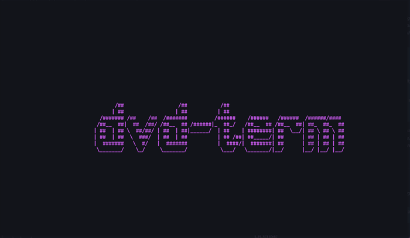

# dvd-term 

[](https://github.com/alefnull/dvd-term/actions)
[](https://crates.io/crates/dvd-term)

A bouncing ASCII art DVD logo (or custom text) for the terminal. Uses [`ruscii`](https://crates.io/crates/ruscii/) for main loop & rendering, and [`figlet-rs`](https://crates.io/crates/figlet-rs) for converting 'logo' text into ASCII art.



- _NOTE: For now, this defaults to using my own custom edit of the "bigmoney-ne" figlet font by Nathan Bloomfield, that I call "hash3d". (Located in the 'assets' directory of the repo). I will probably add the ability to specify other built-in or custom fonts in the future._

```
Usage: dvd-term [OPTIONS]

Options:
      -t, --text <TEXT>    The custom text to use. Defaults to "DVD"
      -c, --color <COLOR>  Initial logo color code (0-255). Defaults to white (15). (https://ss64.com/bash/syntax-colors.html)
      -r, --random         If included, logo will randomize color when it bounces
      -s, --speed <SPEED>  The speed of the logo (how many 'cells' to move per second). Defaults to 15
      -h, --help           Print help
      -V, --version        Print version
```

- _NOTE: At the moment, 'speed' is tied directly to the "game loop", if you will, so hitting `Q` or `Esc` to quit while using very low speed values (1 'cell' per second, for example) can have up to a second's delay after input before quitting. I hope to try and uncouple this at some point._

## Installation

### Cargo

* Install the rust toolchain in order to have cargo installed by following
  [this](https://www.rust-lang.org/tools/install) guide.
* run `cargo install dvd-term`

## License

Licensed under either of

 * Apache License, Version 2.0
   ([LICENSE-APACHE](LICENSE-APACHE) or http://www.apache.org/licenses/LICENSE-2.0)
 * MIT license
   ([LICENSE-MIT](LICENSE-MIT) or http://opensource.org/licenses/MIT)

at your option.
